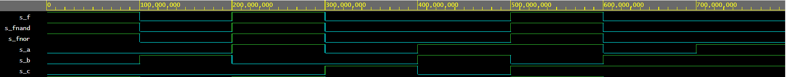

# Digital-electronics-1
## DPC-DE1  2021
Jakub Uhrin 221457
### 01 Gates

1. Github link: https://github.com/Jakub-Uhrin/Digital-electronics-1

2. VLD Playground kód:

design:
```
------------------------------------------------------------------------
--Verification of De Morgan's laws of function
------------------------------------------------------------------------

library ieee;               -- Standard library
use ieee.std_logic_1164.all;-- Package for data types and logic operations

------------------------------------------------------------------------
-- Entity declaration 
------------------------------------------------------------------------
entity gates is
    port(
        a_i    : in  std_logic;         -- Data input
        b_i    : in  std_logic;         -- Data input
        c_i	   : in  std_logic;
       
        f_o    : out std_logic; 
        fnand_o: out std_logic;
        fnor_o : out std_logic
       
   );
end entity gates;

------------------------------------------------------------------------
-- Architecture body for basic gates
------------------------------------------------------------------------
architecture dataflow of gates is
begin
    f_o     <= ((not b_i) and a_i) or ((not c_i) and (not b_i));
    fnand_o <= ((not b_i) nand a_i)nand((not c_i) nand (not b_i));
    fnor_o  <= (b_i nor (not a_i)) or ( c_i nor b_i);

end architecture dataflow;
```

testbench:
```
------------------------------------------------------------
--Verification of De Morgan's laws of function
------------------------------------------------------------

library ieee;
use ieee.std_logic_1164.all;

------------------------------------------------------------
-- Entity declaration for testbench
------------------------------------------------------------
entity tb_gates is
 -- Entity of testbench is always empty
end entity tb_gates;

------------------------------------------------------------
-- Architecture body for testbench
------------------------------------------------------------
architecture testbench of tb_gates is

    -- Local signals
    signal s_a     : std_logic;
    signal s_b     : std_logic;
    signal s_c     : std_logic;
    signal s_f     : std_logic;
    signal s_fnand : std_logic;
    signal s_fnor  : std_logic;

begin
    
    uut_gates : entity work.gates
        port map(
            a_i     => s_a,
            b_i     => s_b,
            c_i     => s_c,
            f_o     => s_f,
            fnand_o => s_fnand,
            fnor_o  => s_fnor
        );

    --------------------------------------------------------------------
    -- Data generation process
    --------------------------------------------------------------------
    p_stimulus : process
    begin
        s_b <= '0';             
        s_a <= '0';
        s_c <= '0';
        wait for 100 ns;
        s_b <= '1';             
        s_a <= '0';
        s_c <= '0';
        wait for 100 ns;
        s_b <= '0';             
        s_a <= '1';
        s_c <= '0';
        wait for 100 ns;
        s_b <= '0';             
        s_a <= '0';
        s_c <= '1';
        wait for 100 ns;
        s_b <= '1';             
        s_a <= '1';
        s_c <= '0';
        wait for 100 ns;
        s_b <= '0';             
        s_a <= '1';
        s_c <= '1';
        wait for 100 ns;
        s_b <= '1';             
        s_a <= '0';
        s_c <= '1';
        wait for 100 ns;
        s_b <= '1';             
        s_a <= '1';
        s_c <= '1';
        wait for 100 ns;
        wait;                  
    end process p_stimulus;

end architecture testbench;
```
Screenshot signálů:


EDA Playgrounds link: https://www.edaplayground.com/x/rvjS
